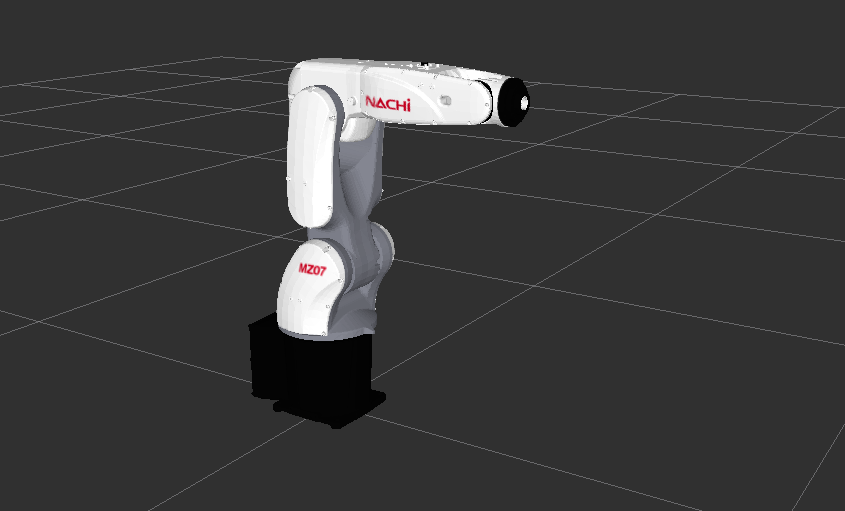
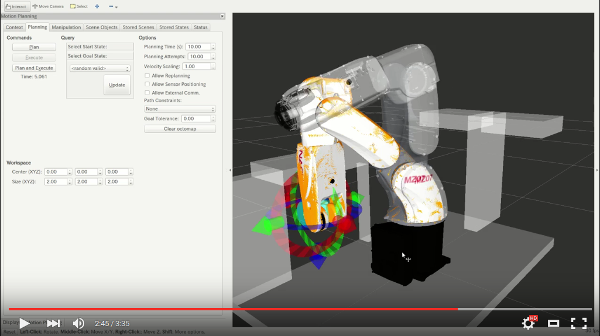
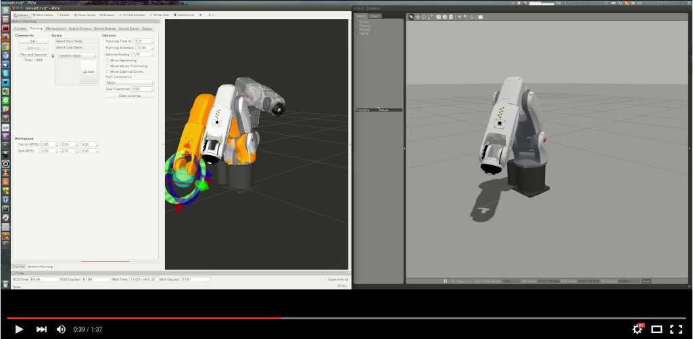
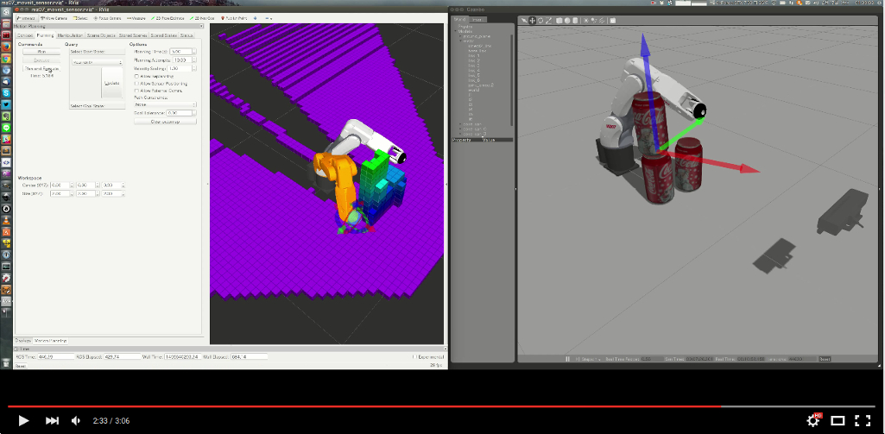

# NACHI Project [](https://travis-ci.org/Nishida-Lab/nachi_project)



## Install
* Install ROS
* ROS distribution **Indigo**
* Create `catkin_ws`

```bash
cd catkin_ws/src
git clone https://github.com/Nishida-Lab/nachi_project.git # This repository
cd ..
rosdep install -i --from-paths src # install dependent packages
catkin_make
```

## MZ07

* rviz上でモデルを確認

```bash
roslaunch nachi_description mz07.launch
```

* ~~moveitでモーションプランニングできる夢を見る~~[現在調整中...下のGazebo+Moveitで試してください]

```bash
roslaunch nachi_mz07_moveit_config demo.launch
```

[](https://youtu.be/Ic1EXZH8A8I)

* まだROSで実機が動くかどうかわからないチャレンジリポジトリ！実機が動かない代わりにgazeboでそれっぽく動かす

```bash
roslaunch nachi_gazebo mz07_empty_world.launch
roslaunch nachi_mz07_moveit_config moveit_planning_execution.launch
```

[](https://youtu.be/rRNhH_FJEAM)

* Kinectを使って障害物を検知したあとモーションプランニング

```bash
roslaunch nachi_gazebo mz07_sensor_world.launch
roslaunch nachi_sensor_moveit mz07_sensor_moveit_planning_execution.launch 
```

[](https://youtu.be/WDWBGGlJTDk)