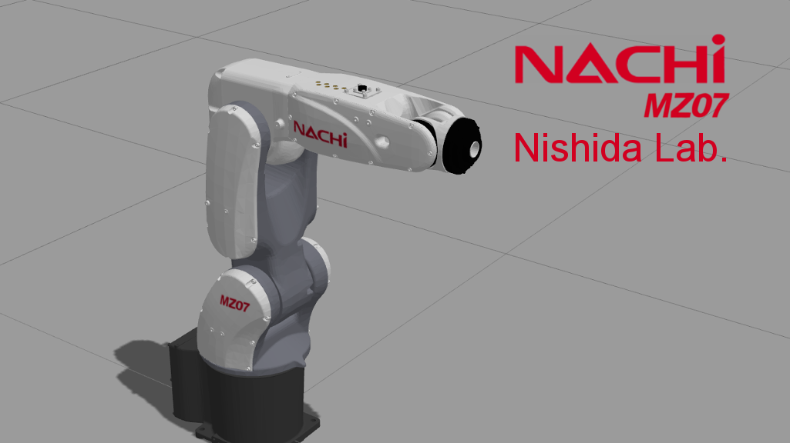

# NACHI Project [](https://travis-ci.org/Nishida-Lab/nachi_project)



## MZ07
* rviz上でモデルを確認

```bash
roslaunch nachi_description mz07.launch
```

* moveitでモーションプランニングできる夢を見る

```bash
roslaunch nachi_mz07_moveit_config demo.launch
```

[](https://youtu.be/Ic1EXZH8A8I)

* まだROSで実機が動くかどうかわからないチャレンジリポジトリ！実機が動かない代わりにgazeboでそれっぽく動かす

```bash
roslaunch nachi_gazebo mz07_empty_world.launch
roslaunch nachi_mz07_moveit_config moveit_planning_execution.launch
```
